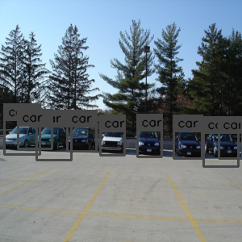

# SSD-Tensorflow

This project is re-implementation of [*SSD: Single Shot MultiBox Detector*](https://arxiv.org/pdf/1512.02325.pdf), in tensorflow based on code from [Lukasz Janyst](https://github.com/ljanyst/ssd-tensorflow).

The network is based on the VGG-16 from [machrisaa](https://github.com/machrisaa/tensorflow-vgg). I tried it with Pascal VOC and KITTI dataset. The test mAP of the original paper has not yet been achieved. It would be great if someone would give me a advice.

## Requirement:

Ubuntu 16.04, Python 3.6, Tensorflow 1.6.0
(Recommend using Anaconda)

## Installation:

1. Set up a virtual environment (optional)
2. Clone the SSD-Tensorflow repository
```
git clone https://github.com/geonseoks/SSD-Tensorflow
```

## Preparation for Training:

1. Download VOC or KITTI data.
2. Download VGG-16 pre-trained model [VGG16.npy](https://github.com/machrisaa/tensorflow-vgg).
I recommend file structure as follows:

```
SSD-Tensorflow/
    |->vgg16.npy
    |->log_dir
    |->output
    |    |->model_dump
    |    |    |->image
    |    |    |->epoch_xxx.ckpt
    |    |    |->eval
```

3. Run python3 process_data.py to make train, test pkl file. It will be generated on SSD-Tensorflow directory.

## Train:

```
python3 train.py --max_epoch=301 \ --output_dir={YOUR_OUTPUT_DIR} \ --ex_dir{YOUR_OUTPUT_DIR_#OF_EXP_FOLDER} \ --train_set='VOC' \ show_img=False \ --save_img=True \ --batch_size=32 \ --num_gpus=2 \ --backbone_dir={YOUR_VGG16.NPY_DIR}
```

## Evalution:

```
python3 inference.py --epoch_num=300 \ --output_dir={YOUR_OUTPUT_DIR} \ --ex_dir{YOUR_OUTPUT_DIR_#OF_EXP_FOLDER} \ --test_set='VOC' \ show_img=False \ --save_img=False \ --batch_size=32 \ --num_gpus=2 \ --backbone_dir={YOUR_VGG16.NPY_DIR}
```

## Result:

|Model|                             Train data                          |                             Test data                           | Classes | Base model | Input resolution | Batch size | Epochs | mAP (%) |
|:---:|:---------------------------------------------------------------:|:---------------------------------------------------------------:|:-------:|:-----------|:----------------:|:----------:|:------:|:-------:|
| [SSD-300](https://drive.google.com/drive/folders/1bBIgvaDsI7Bs8_2oR_GupnpNVAXTOqoS)|[VOC07](http://http://host.robots.ox.ac.uk/pascal/VOC/voc2007/) | [VOC07](http://http://host.robots.ox.ac.uk/pascal/VOC/voc2007/) |    20   |  VGG16  |      300x300     |     32     |   300  |   52.1  |

Here are two examples of detect box outputs:




## Loss graph


## Project structure

### Folders

- [``pictures``](https://github.com/geonseoks/SSD-Tensorflow/tree/master/pictures): Contains VOC07 test image.
- [``loss_graphs``](https://github.com/geonseoks/SSD-Tensorflow/tree/master/loss_graphs): Contains training loss graphs.

### Files

- [``bbox.py``](https://github.com/geonseoks/SSD-Tensorflow/blob/master/bbox.py): Defines detect bounding box and nms.
- [``dataset.py``](https://github.com/geonseoks/SSD-Tensorflow/blob/master/dataset.py): Contains all command-line options.
- [``inference.py``](https://github.com/geonseoks/SSD-Tensorflow/blob/master/inference.py): Defines testing the model.
- [``process_data.py``](https://github.com/geonseoks/SSD-Tensorflow/blob/master/process_data.py): Defines pkl file of train and test set.
- [``ssd_network.py``](https://github.com/geonseoks/SSD-Tensorflow/blob/master/ssd_network.py): Defines computational graph and loss calculation.
- [``ssdutils.py``](https://github.com/geonseoks/SSD-Tensorflow/blob/master/ssdutils.py): Define anchor, calculate overlap and box coordinate.
- [``train.py``](https://github.com/geonseoks/SSD-Tensorflow/blob/master/train.py): Defines training the model and all command-line options.
- [``transforms.py``](https://github.com/geonseoks/SSD-Tensorflow/blob/master/transforms.py): Defines data augmentations to train network.
- [``utils.py``](https://github.com/geonseoks/SSD-Tensorflow/blob/master/utils.py): Calculates box coordinate.
- [``voc_eval.py``](https://github.com/geonseoks/SSD-Tensorflow/blob/master/voc_eval.py): Defines mAP calculator.

## To do:

Increase the mAP up to 0.68mAP in original paper.
